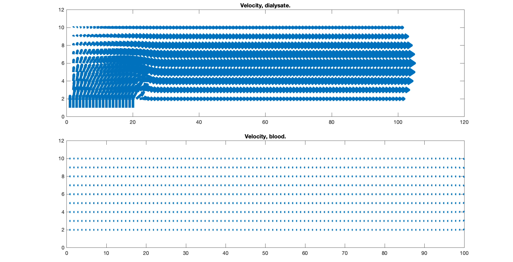

# Repository.

A 2D small animal dialyser model based on advection-diffusion-transport Navier Stokes equations.

# Background. 

In a dialyser tube, blood flows from right to left in small porous tubes and dialysate liquid flows from left to right in the larger tube but
outside the porous tubes. The efficacy of the dialyser is assesed by how much water and urea the blood transfers to the dialysate liquid, while being as compact as possible, and when the porous tubes have optimal porosity. Whereas the geometry has been optimised by others,the porous material and optimal diameters of the porous tubes is subject of active research. A dialyser tube is being developed in Lawson for use in experimental animals. This C program uses the vorticity-transport paradigm to simulate simultaneous blood and dialysate flow. Further, it exchanges toxins, neutrients, and water between the two fluids.

# Dependencies and source.

This GNU C program is in the sources/ directory.

# Description and use.

The program is a finite difference code that solves for streamfunction followed by vorticity to provide pressure and velocity in the 2D models. Five geometry variants are considered. A placeholder function attempts to simulate the diffusion of solutes thru' the porous medium but may be sub-optimal due to numerical instability. Shown below is a draft of the simulated velocities in the dialysate (top) panel and the blood (bottom pane).  

# Uptake by other users.

When fully developed and tested, it will complement device development IP such as the dialyser. It can be extended to other fields such as ground water movement, biochemical exchangers.

# Maintainer.

SR Kharche.

# Acknowledements.

This project was generously funded by CANARIE Inc. Canada (April 2020 to March 2023). 

# Licence.

This program is not opensource at present time.

## Dr. Sanjay R. Kharche, Ph.D. (App. Maths).  
January 23rd, 2023.  
Email: Sanjay.Kharche@lhsc.on.ca , skharche@uwo.ca , srk.london@yahoo.com .  
Phone: +15198780685 (mobile).  
Website: https://kcru.lawsonresearch.ca/research/srk/index.html  

